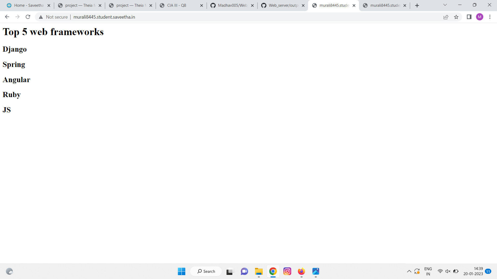

# Developing a Simple Webserver

# AIM:
Name: Murali.S
Ref No: 22008445
Develop a webserver to display about top five web application development frameworks.

# DESIGN STEPS:

## Step 1:

HTML content creation is done

## Step 2:

Design of webserver workflow

## Step 3:

Implementation using Python code

## Step 4:

Serving the HTML pages.

## Step 5:

Testing the webserver

# PROGRAM:
```
from http.server import HTTPServer, BaseHTTPRequestHandler

content ="""
<html>
<head>
</head>
<body>
<h1>Top 5 web frameworks</h1>
<h2>Django</h2>
<h2>Spring</h2>
<h2>Angular</h2>
<h2>Ruby</h2>
<h2>JS</h2>

</body>
</html>
"""

class HelloHandler(BaseHTTPRequestHandler):
    def do_GET(self):
        self.send_response(200)
        self.send_header('Content-type','text/html; charset=utf-8')
        self.end_headers()
        self.wfile.write(content.encode())


server_address = ('', 80)
httpd = HTTPServer(server_address, HelloHandler)
httpd.serve_forever()
        

```
# OUTPUT:


# RESULT:

The program is executed succesfully
